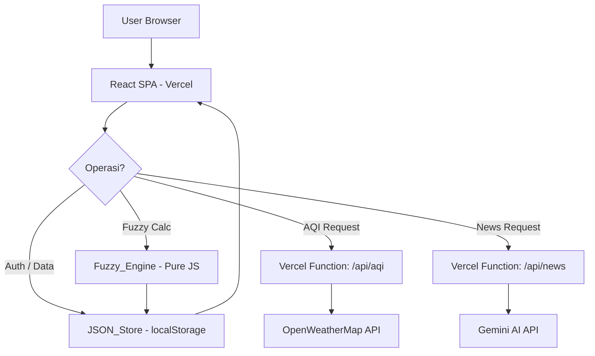

# Design Document: JSON Migration & Fuzzy Logic System

## Overview

Dokumen ini mendeskripsikan desain teknis untuk dua perubahan besar pada aplikasi **RESPIRA.ID**:

1. **Migrasi ke JSON_Store**: Menghapus ketergantungan pada backend Express + MySQL/PostgreSQL dan menggantinya dengan lapisan penyimpanan berbasis `localStorage`. Tujuannya adalah agar aplikasi dapat di-hosting sepenuhnya di Vercel sebagai pure frontend SPA.

2. **Fuzzy Logic System (FLS)**: Menambahkan modul `Fuzzy_Engine` berbasis JavaScript murni yang mengimplementasikan logika fuzzy Mamdani untuk menilai tingkat risiko pernapasan pasien secara kuantitatif.

### Konteks Teknis

- **Frontend**: React 19 + Vite 7 + Tailwind CSS 3
- **Routing**: React Router DOM v6
- **State Management**: React Context API (`AuthContext`)
- **Target Hosting**: Vercel (frontend SPA + Serverless Functions)
- **Tidak ada backend server** setelah migrasi selesai

### Keputusan Desain Utama

| Keputusan | Pilihan | Alasan |
|---|---|---|
| Storage engine | `localStorage` | Tersedia di semua browser modern, tidak perlu server, cukup untuk data per-user |
| Fuzzy method | Mamdani | Interpretable, cocok untuk domain medis, output berupa linguistic variable |
| Defuzzification | Centroid (CoG) | Menghasilkan nilai kontinu yang smooth, standar industri untuk Mamdani |
| Serverless | Vercel Functions | AQI dan News memerlukan API key yang tidak boleh di-expose di frontend |
| Auth | localStorage-based | Tidak ada session server; token disimpan lokal |

---

## Architecture

### Arsitektur Sebelum Migrasi

```
Browser (React SPA)
    │
    ├── fetch() → http://localhost:5000/api/*
    │                   │
    │             Express Server
    │                   │
    │             MySQL/PostgreSQL
    │
    └── Vercel (tidak bisa deploy karena butuh DB server)
```

### Arsitektur Setelah Migrasi

```
Browser (React SPA) — Vercel Static Hosting
    │
    ├── JSON_Store (localStorage)
    │       ├── respira_users
    │       ├── respira_current_user
    │       ├── respira_diagnosis_logs
    │       └── respira_checkins
    │
    ├── Fuzzy_Engine (pure JS module)
    │       └── src/services/fuzzyEngine.js
    │
    └── Vercel Serverless Functions
            ├── /api/aqi  → OpenWeatherMap API
            └── /api/news → Gemini AI API
```

### Diagram Alur Data



---

## Components and Interfaces

### 1. JSON_Store (`src/services/jsonStore.js`)

Modul baru yang menjadi lapisan abstraksi tunggal untuk semua operasi `localStorage`. Semua komponen dan service harus menggunakan modul ini, bukan mengakses `localStorage` secara langsung.

```javascript
// Interface JSON_Store
const jsonStore = {
  // --- USERS ---
  getUsers(): User[]
  saveUsers(users: User[]): void
  seedInitialData(): void

  // --- AUTH ---
  registerUser(userData: RegisterPayload): AuthResult
  loginUser(email: string, password: string): AuthResult
  logoutUser(): void
  getCurrentUser(): User | null
  updateCurrentUser(user: User): void

  // --- DIAGNOSIS LOGS ---
  getDiagnosisLogs(userId: string): DiagnosisLog[]
  saveDiagnosisLog(log: DiagnosisLogPayload): SaveResult
  getAllDiagnosisLogs(): DiagnosisLog[]

  // --- CHECKINS ---
  getTodayCheckin(userId: string): Checkin | null
  saveCheckin(userId: string, score: number): SaveResult

  // --- PROFILE ---
  getProfile(userId: string): User | null
  updateProfile(userId: string, profileData: ProfilePayload): SaveResult

  // --- ADMIN STATS ---
  getAdminStats(): AdminStats
}
```

**localStorage Keys:**

| Key | Tipe | Deskripsi |
|---|---|---|
| `respira_users` | `User[]` | Semua pengguna terdaftar |
| `respira_current_user` | `User` | Sesi pengguna aktif |
| `respira_diagnosis_logs` | `DiagnosisLog[]` | Semua log diagnosis |
| `respira_checkins` | `Checkin[]` | Semua data check-in harian |

### 2. Auth Service (`src/services/authService.js`) — Refactored

Semua `fetch()` ke backend dihapus. Setiap method sekarang mendelegasikan ke `jsonStore`.

```javascript
// authService.js (setelah migrasi)
export const authService = {
  login: (email, password) => jsonStore.loginUser(email, password),
  register: (userData) => jsonStore.registerUser(userData),
  logout: () => jsonStore.logoutUser(),
  getCurrentUser: () => jsonStore.getCurrentUser(),
}
```

### 3. API Service (`src/services/api.js`) — Refactored

Semua endpoint yang sebelumnya memanggil Express backend diganti dengan operasi `jsonStore`. Hanya `/api/aqi` dan `/api/news` yang tetap menggunakan `fetch()` — tetapi sekarang mengarah ke Vercel Serverless Functions.

```javascript
// api.js (setelah migrasi) — contoh perubahan
export const api = {
  // SEBELUM: fetch(`${API_URL}/login`, ...)
  // SESUDAH:
  login: (email, password) => jsonStore.loginUser(email, password),
  register: (userData) => jsonStore.registerUser(userData),
  getHistory: (userId) => ({ success: true, data: jsonStore.getDiagnosisLogs(userId) }),
  saveDiagnosis: (data) => jsonStore.saveDiagnosisLog(data),
  getScore: (userId) => {
    const checkin = jsonStore.getTodayCheckin(userId);
    return { success: true, score: checkin?.score ?? null };
  },
  saveScore: (userId, score) => jsonStore.saveCheckin(userId, score),
  getProfile: (userId) => ({ success: true, data: jsonStore.getProfile(userId) }),
  updateProfile: (userId, data) => jsonStore.updateProfile(userId, data),

  // Tetap menggunakan fetch ke Vercel Functions:
  getAQI: (lat, lon) => fetch('/api/aqi', { method: 'POST', body: JSON.stringify({ lat, lon }) }).then(r => r.json()),
  getNews: () => fetch('/api/news', { method: 'POST' }).then(r => r.json()),
}
```

### 4. Fuzzy Engine (`src/services/fuzzyEngine.js`)

Modul JavaScript murni tanpa dependensi eksternal. Mengimplementasikan sistem fuzzy Mamdani lengkap.

```javascript
// Interface Fuzzy_Engine
export const fuzzyEngine = {
  // Fungsi keanggotaan primitif
  trapezoid(x, a, b, c, d): number,  // returns [0, 1]
  triangle(x, a, b, c): number,       // returns [0, 1]

  // Fuzzifikasi
  fuzzifyCough(value): CoughMembership,
  fuzzifyBreathlessness(value): BreathlessnessMembership,
  fuzzifySpO2(value): SpO2Membership,

  // Inferensi
  applyRules(coughMem, breathMem, spo2Mem): RuleResult[],

  // Defuzzifikasi
  defuzzifyCentroid(ruleResults): number,

  // Entry point utama
  assess(inputs: FuzzyInputs): FuzzyResult,
}
```

**Input/Output Types:**

```typescript
interface FuzzyInputs {
  coughFrequency: number;    // 0–20 (kali/hari)
  breathlessnessLevel: number; // 0–10 (skala)
  spo2Level: number;         // 70–100 (%)
}

interface FuzzyResult {
  riskScore: number;         // 0–100
  riskLevel: 'Rendah' | 'Sedang' | 'Tinggi' | 'Kritis';
  membershipDegrees: {
    cough: { rendah: number, sedang: number, tinggi: number },
    breathlessness: { ringan: number, sedang: number, berat: number },
    spo2: { normal: number, rendah: number, sangat_rendah: number }
  };
  appliedRules: Array<{ rule: string, strength: number, output: string }>;
}
```

### 5. Vercel Serverless Functions

Dua file baru di folder `api/` (root project):

**`api/aqi.js`** — Proxy ke OpenWeatherMap:
```javascript
// api/aqi.js
export default async function handler(req, res) {
  const { lat, lon } = req.body;
  // fetch ke OpenWeatherMap dengan API key dari env var
  // return { success, data: { aqi, pm25, co, city } }
}
```

**`api/news.js`** — Proxy ke Gemini AI:
```javascript
// api/news.js
export default async function handler(req, res) {
  // Panggil Gemini AI dengan GEMINI_API_KEY dari env var
  // return { success, data: [...newsItems] }
}
```

**`vercel.json`** (diperbarui):
```json
{
  "rewrites": [
    { "source": "/api/aqi", "destination": "/api/aqi" },
    { "source": "/api/news", "destination": "/api/news" },
    { "source": "/(.*)", "destination": "/index.html" }
  ]
}
```

### 6. Halaman Fuzzy Assessment (`src/pages/FuzzyAssessment.jsx`)

Halaman baru yang dapat diakses di route `/fuzzy-assessment` oleh pengguna dengan role `patient`.

**Komponen utama:**
- `FuzzyInputSlider` — slider interaktif untuk cough dan breathlessness
- `SpO2Input` — input numerik dengan validasi real-time
- `RiskGauge` — visualisasi gauge/progress bar dengan warna dinamis
- `MembershipChart` — visualisasi kurva membership function (menggunakan Recharts)
- `AssessmentHistory` — tabel 5 riwayat assessment terakhir

### 7. Perubahan `src/App.jsx`

Tambah route baru:
```jsx
import FuzzyAssessment from './pages/FuzzyAssessment';

// Di dalam Routes:
<Route path="/fuzzy-assessment" element={
  <ProtectedRoute allowedRoles={['patient']}>
    <AppShell>
      <FuzzyAssessment />
    </AppShell>
  </ProtectedRoute>
} />
```

---

## Data Models

### User

```typescript
interface User {
  id: string;              // UUID v4
  email: string;
  password: string;        // plain text (sesuai implementasi existing)
  name: string;
  role: 'patient' | 'expert';
  licenseCode: string | null;
  // Profile fields (opsional, diisi saat update profil)
  height?: number;
  weight?: number;
  blood_type?: string;
  birth_date?: string;     // ISO date string
  emergency_contact?: string;
  // Expert-only fields
  institution?: string;
  title_degree?: string;
  sip_number?: string;
}
```

**Seed Data** (dari `db.json`):
```json
[
  {
    "id": "1",
    "email": "admin@respira.id",
    "password": "admin",
    "name": "Dr. Sarah Sp.P",
    "role": "expert",
    "licenseCode": "DOKTER123"
  },
  {
    "id": "2",
    "email": "user@gmail.com",
    "password": "user123",
    "name": "Budi Santoso",
    "role": "patient",
    "licenseCode": null
  }
]
```

### DiagnosisLog

```typescript
interface DiagnosisLog {
  id: string;              // UUID v4
  userId: string;
  finalResult: string;     // Nama diagnosis dari Decision_Tree
  confidenceScore: number; // 0–100
  symptomsSummary: Record<string, any>; // Jawaban dari Decision_Tree
  riskScore: number | null;   // Dari Fuzzy_Engine, null jika tidak diisi
  riskLevel: string | null;   // 'Rendah'|'Sedang'|'Tinggi'|'Kritis'|null
  severity: string;           // 'low'|'moderate'|'high'|'critical'
  createdAt: string;          // ISO 8601 timestamp
}
```

### Checkin

```typescript
interface Checkin {
  id: string;              // UUID v4
  userId: string;
  score: number;           // 0–100
  checkDate: string;       // 'YYYY-MM-DD'
}
```

### AdminStats

```typescript
interface AdminStats {
  totalToday: number;
  criticalCount: number;
  totalUsers: number;
  totalDiagnoses: number;
  diseaseDistribution: Array<{ name: string, value: number }>;
  activityLog: Array<{ date: string, count: number }>;
}
```

### FuzzyMembershipSets

```
coughFrequency (0–20):
  rendah:  trapezoid [0, 0, 2, 5]
  sedang:  triangle  [3, 8, 13]
  tinggi:  trapezoid [10, 15, 20, 20]

breathlessnessLevel (0–10):
  ringan:  trapezoid [0, 0, 2, 4]
  sedang:  triangle  [3, 5, 7]
  berat:   trapezoid [6, 8, 10, 10]

spo2Level (70–100):
  normal:       trapezoid [95, 100, 100, 100]
  rendah:       triangle  [88, 93, 97]
  sangat_rendah: trapezoid [70, 70, 85, 92]

risikoPernapasan (output, 0–100):
  rendah:  trapezoid [0, 0, 15, 30]
  sedang:  trapezoid [20, 35, 45, 60]
  tinggi:  trapezoid [50, 60, 70, 80]
  kritis:  trapezoid [70, 85, 100, 100]
```

### Fuzzy Inference Rules (Mamdani)

| # | Batuk | Sesak | SpO2 | Output |
|---|---|---|---|---|
| R1 | rendah | ringan | normal | rendah |
| R2 | rendah | ringan | rendah | sedang |
| R3 | rendah | sedang | normal | sedang |
| R4 | sedang | sedang | normal | sedang |
| R5 | sedang | sedang | rendah | tinggi |
| R6 | sedang | berat | rendah | tinggi |
| R7 | tinggi | berat | rendah | kritis |
| R8 | tinggi | berat | sangat_rendah | kritis |
| R9 | rendah | ringan | sangat_rendah | tinggi |
| R10 | sedang | ringan | sangat_rendah | tinggi |
| R11 | tinggi | sedang | normal | tinggi |
| R12 | tinggi | sedang | rendah | kritis |

Setiap aturan menggunakan operator AND (minimum) untuk menggabungkan anteseden, dan metode max untuk agregasi output.

---


## Correctness Properties

*A property is a characteristic or behavior that should hold true across all valid executions of a system — essentially, a formal statement about what the system should do. Properties serve as the bridge between human-readable specifications and machine-verifiable correctness guarantees.*

Fitur ini memiliki dua komponen yang sangat cocok untuk property-based testing:
1. **JSON_Store** — operasi baca/tulis data yang harus mempertahankan integritas data
2. **Fuzzy_Engine** — fungsi matematika murni dengan input/output yang terdefinisi jelas

Library PBT yang digunakan: **[fast-check](https://fast-check.io/)** (JavaScript/TypeScript, kompatibel dengan Vitest).

---

### Property Reflection

Sebelum menulis properties final, berikut adalah analisis redundansi:

- **1.2 (register user baru) + 1.4 (login berhasil)** dapat digabung menjadi satu round-trip property: register → login → getCurrentUser
- **7.2, 7.3, 7.4** (membership degree untuk masing-masing input) dapat digabung menjadi satu property: untuk semua input valid, semua membership degrees harus dalam [0,1]
- **11.1, 11.2, 11.3** (validasi input out-of-range) dapat digabung menjadi satu property: untuk semua input di luar range, engine harus mengembalikan error
- **3.1 + 3.3** (save checkin + read today) adalah round-trip yang sama, digabung
- **4.1 + 4.2 + 4.3** (update + read profile) adalah round-trip yang sama, digabung
- **2.3** (filter + sort) adalah property tersendiri yang tidak redundan dengan 2.1

---

### Property 1: Auth Round-Trip — Register lalu Login

*For any* valid user registration payload (name, email, password, role), setelah registrasi berhasil, melakukan login dengan email dan password yang sama harus berhasil dan mengembalikan data pengguna yang ekuivalen (tanpa field password).

**Validates: Requirements 1.2, 1.4**

---

### Property 2: Duplikasi Email Ditolak

*For any* email yang sudah terdaftar di JSON_Store, mencoba mendaftarkan pengguna baru dengan email yang sama harus mengembalikan `{ success: false }` dan tidak menambah jumlah pengguna di store.

**Validates: Requirements 1.3**

---

### Property 3: Logout Menghapus Sesi

*For any* pengguna yang sedang login (sesi aktif di `respira_current_user`), memanggil `logoutUser()` harus menghasilkan `getCurrentUser()` mengembalikan `null`.

**Validates: Requirements 1.6**

---

### Property 4: Validasi Kode Lisensi Expert

*For any* string yang dimasukkan sebagai `licenseCode` saat registrasi dengan role `expert`, hanya string yang ada dalam daftar kode valid yang menghasilkan registrasi berhasil; semua string lain harus ditolak.

**Validates: Requirements 1.8**

---

### Property 5: Diagnosis Log Round-Trip

*For any* `DiagnosisLog` payload yang valid (dengan semua field wajib), menyimpan log lalu membacanya kembali dengan `getDiagnosisLogs(userId)` harus menghasilkan objek yang ekuivalen dengan data yang disimpan.

**Validates: Requirements 2.1, 2.2**

---

### Property 6: Filter dan Urutan Riwayat Diagnosis

*For any* set `DiagnosisLog` yang berisi log dari beberapa userId berbeda, `getDiagnosisLogs(userId)` harus mengembalikan hanya log milik `userId` tersebut, diurutkan berdasarkan `createdAt` secara descending (terbaru di atas).

**Validates: Requirements 2.3**

---

### Property 7: Batas Maksimal 100 Log Per Pengguna

*For any* pengguna yang sudah memiliki 100 `DiagnosisLog`, menyimpan satu log baru harus menghasilkan total tetap 100 entri (bukan 101), dan entri dengan `createdAt` paling lama harus tidak ada lagi.

**Validates: Requirements 2.5**

---

### Property 8: Check-in Harian Round-Trip

*For any* `userId` dan nilai `score` yang valid (0–100), menyimpan check-in lalu membaca `getTodayCheckin(userId)` pada hari yang sama harus mengembalikan skor yang sama.

**Validates: Requirements 3.1, 3.3**

---

### Property 9: Idempotence Check-in Harian

*For any* `userId`, melakukan check-in dua kali pada hari yang sama dengan skor berbeda harus menghasilkan tepat satu entri check-in untuk hari itu, dengan skor dari check-in terakhir.

**Validates: Requirements 3.4**

---

### Property 10: Profil Round-Trip

*For any* `userId` yang valid dan data profil (termasuk field expert jika role `expert`), memanggil `updateProfile()` lalu `getProfile()` harus mengembalikan data profil yang ekuivalen dengan data yang diperbarui.

**Validates: Requirements 4.1, 4.2, 4.3**

---

### Property 11: Statistik Admin Akurat

*For any* set `DiagnosisLog` yang tersimpan, `getAdminStats()` harus mengembalikan `totalDiagnoses` yang sama dengan jumlah total log, dan `diseaseDistribution` yang jumlah totalnya sama dengan `totalDiagnoses`.

**Validates: Requirements 5.1, 5.2**

---

### Property 12: JSON Round-Trip (Serialisasi)

*For any* objek data yang disimpan di JSON_Store (User, DiagnosisLog, Checkin), `JSON.parse(JSON.stringify(data))` harus menghasilkan objek yang ekuivalen dengan data asli (semua field dengan nilai yang sama).

**Validates: Requirements 12.4**

---

### Property 13: Membership Degree Selalu dalam [0, 1]

*For any* nilai input yang valid (`coughFrequency` ∈ [0,20], `breathlessnessLevel` ∈ [0,10], `spo2Level` ∈ [70,100]), semua derajat keanggotaan yang dihasilkan oleh fungsi `trapezoid` dan `triangle` harus berada dalam rentang [0, 1] inklusif.

**Validates: Requirements 7.2, 7.3, 7.4, 7.6, 7.7**

---

### Property 14: Input di Luar Range Menghasilkan Error

*For any* nilai input yang berada di luar rentang valid (cough < 0 atau > 20, breathlessness < 0 atau > 10, SpO2 < 70 atau > 100), `fuzzyEngine.assess()` harus mengembalikan objek error tanpa melempar exception yang tidak tertangani.

**Validates: Requirements 7.5, 11.1, 11.2, 11.3**

---

### Property 15: SpO2 Sangat Rendah Selalu Menghasilkan Risiko Tinggi

*For any* kombinasi `coughFrequency` dan `breathlessnessLevel` yang valid, ketika `spo2Level` < 85, `fuzzyEngine.assess()` harus menghasilkan `riskScore` ≥ 70 (klasifikasi Tinggi atau Kritis).

**Validates: Requirements 8.3**

---

### Property 16: Determinisme Fuzzy Engine

*For any* set input valid yang sama, memanggil `fuzzyEngine.assess()` dua kali harus menghasilkan `riskScore` yang identik (fungsi deterministik/idempoten).

**Validates: Requirements 8.6**

---

### Property 17: Struktur Output Fuzzy Engine Lengkap

*For any* input valid, `fuzzyEngine.assess()` harus mengembalikan objek yang memiliki semua field wajib: `riskScore` (number dalam [0,100]), `riskLevel` (salah satu dari 'Rendah'|'Sedang'|'Tinggi'|'Kritis'), `membershipDegrees` (objek dengan semua sub-field), dan `appliedRules` (array non-null).

**Validates: Requirements 8.5**

---

### Property 18: Performa Fuzzy Engine < 50ms

*For any* input valid, waktu eksekusi `fuzzyEngine.assess()` harus kurang dari 50 milidetik.

**Validates: Requirements 12.1**

---

### Property 19: Warna Gauge Sesuai Risk Level

*For any* nilai `riskLevel` ('Rendah', 'Sedang', 'Tinggi', 'Kritis'), komponen `RiskGauge` harus merender dengan class CSS warna yang sesuai (hijau, kuning, oranye, merah).

**Validates: Requirements 9.3**

---

### Property 20: Riwayat Assessment Menampilkan Maksimal 5 Terakhir

*For any* pengguna dengan N assessment tersimpan (N ≥ 5), halaman Fuzzy Assessment harus menampilkan tepat 5 assessment, yaitu yang paling baru berdasarkan `createdAt`.

**Validates: Requirements 10.6**

---

## Error Handling

### JSON_Store Error Handling

Semua operasi `localStorage` dibungkus dalam `try/catch`. Jika `localStorage` tidak tersedia atau penuh, operasi mengembalikan objek error standar:

```javascript
// Pola error return yang konsisten
{ success: false, message: 'Deskripsi error yang jelas', data: null }
```

**Skenario error yang ditangani:**

| Skenario | Penanganan |
|---|---|
| `localStorage` tidak tersedia | Tampilkan notifikasi di UI, kembalikan `{ success: false }` |
| `localStorage` penuh (QuotaExceededError) | Kembalikan error dengan pesan deskriptif |
| Data JSON corrupt (parse error) | Reset key yang corrupt ke nilai default, log warning |
| User tidak ditemukan | Kembalikan `null` atau `{ success: false, message: '...' }` |
| Duplikasi email | Kembalikan `{ success: false, message: 'Email sudah terdaftar.' }` |

### Fuzzy Engine Error Handling

```javascript
// Validasi input sebelum kalkulasi
if (spo2Level < 70 || spo2Level > 100) {
  return { success: false, message: 'Nilai SpO2 harus antara 70–100%' };
}
// dst untuk input lain
```

Engine tidak pernah melempar exception; selalu mengembalikan objek dengan field `success`.

### Vercel Serverless Functions Error Handling

Jika API eksternal (OpenWeatherMap, Gemini) gagal, functions mengembalikan data fallback (mock data) agar UI tetap berfungsi:

```javascript
// Fallback AQI
catch (err) {
  return res.json({ success: true, data: { aqi: 2, pm25: 15.5, co: 240, city: 'Mode Demo' } });
}
```

---

## Testing Strategy

### Pendekatan Dual Testing

Strategi pengujian menggunakan dua lapisan yang saling melengkapi:

1. **Unit Tests** — untuk skenario spesifik, edge case, dan integrasi antar komponen
2. **Property-Based Tests** — untuk memverifikasi properti universal di seluruh ruang input

### Library dan Tools

| Tool | Kegunaan |
|---|---|
| **Vitest** | Test runner (sudah kompatibel dengan Vite) |
| **fast-check** | Property-based testing library |
| **@testing-library/react** | Testing komponen React |
| **jsdom** | Simulasi browser environment (localStorage) |

### Konfigurasi Property Tests

Setiap property test dikonfigurasi dengan minimum **100 iterasi** (default fast-check). Tag format untuk setiap test:

```javascript
// Tag format: Feature: json-migration-fuzzy-system, Property N: <deskripsi singkat>
it('Feature: json-migration-fuzzy-system, Property 16: fuzzy engine is deterministic', () => {
  fc.assert(
    fc.property(validInputArbitrary, (inputs) => {
      const result1 = fuzzyEngine.assess(inputs);
      const result2 = fuzzyEngine.assess(inputs);
      return result1.riskScore === result2.riskScore;
    }),
    { numRuns: 100 }
  );
});
```

### Unit Tests (Contoh Skenario)

**JSON_Store:**
- Seed data muncul saat `respira_users` kosong (Req 1.7)
- `getAdminStats()` mengembalikan zeros saat tidak ada data (Req 5.4)
- Login dengan kredensial salah mengembalikan pesan error yang tepat (Req 1.5)
- Diagnosis log diinisialisasi sebagai array kosong (Req 2.4)

**Fuzzy Engine:**
- Input normal (batuk=1, sesak=1, SpO2=98) menghasilkan riskScore ≤ 30 (Req 8.2)
- Minimal 9 aturan aktif untuk input yang memicu semua himpunan (Req 8.1)
- Defuzzifikasi centroid menghasilkan nilai yang diharapkan untuk output set yang diketahui (Req 8.4)

**UI Components:**
- Form Fuzzy Assessment muncul saat `currentNode.type === 'result'` (Req 9.1)
- Route `/fuzzy-assessment` hanya dapat diakses oleh role `patient` (Req 10.1)
- Notifikasi muncul saat `localStorage` tidak tersedia (Req 11.5)

### Integration Tests

- `GET /api/aqi` mengembalikan struktur `{ success, data: { aqi, pm25, co, city } }` (Req 6.2)
- `POST /api/news` mengembalikan struktur `{ success, data: [...] }` (Req 6.3)

### Smoke Tests

- `vite build` berhasil tanpa error (Req 6.4)
- Tidak ada `fetch` ke `localhost:5000` di codebase setelah migrasi (Req 6.1)
- `fuzzyEngine.js` dapat di-`require` di Node.js tanpa error (Req 8.7)

### Struktur File Test

```
src/
  __tests__/
    services/
      jsonStore.test.js       # Unit + Property tests untuk JSON_Store
      fuzzyEngine.test.js     # Unit + Property tests untuk Fuzzy_Engine
    pages/
      FuzzyAssessment.test.jsx # UI component tests
    components/
      RiskGauge.test.jsx       # Property test untuk warna gauge
api/
  __tests__/
    aqi.test.js               # Integration test
    news.test.js              # Integration test
```
